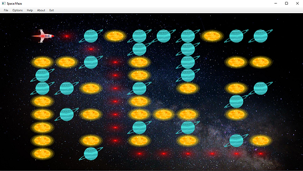

# Maze Project

This project, created as a university coursework, was an engaging learning experience. It allowed me to delve into various concepts including Design Patterns, SOLID principles, threads, and architectures using Java.
 
## Project Breakdown

The project is primarily divided into three main parts:

### Algorithms
- Maze generation using simple single path and Randomized Prim's algorithm.
- Various searching algorithms including BreadthFirstSearch, BestFirstSearch, and DepthFirstSearch.
- Utilization of Adapter Design Pattern to adapt a Maze instance to a searchable maze.

### Client-Server Architecture
- The server utilizes a thread pool to handle multiple clients and employs the Strategy Design Pattern to dynamically handle two types of client requests – Maze generation and Solution to the maze.
- Data compression between communications through binary data conversion into 8-bit integers. A configuration file determines the algorithm types used.

### GUI and MVVM Architecture
- The project includes a GUI developed with JavaFX and SceneBuilder.
- Implementation of MVVM architecture using the observer design pattern.
- Additional features encompass music, zoom, diagonal movement of the character, visual solution path, and saving/loading mazes.

